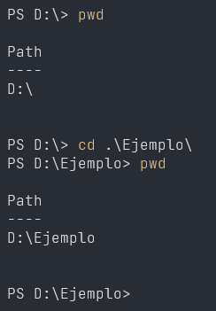
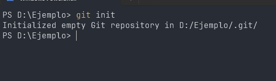
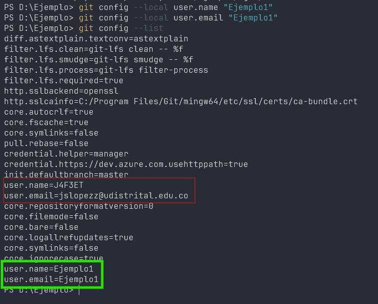

# Introducción a Git y Control de Versiones (30 minutos)
**Objetivo:** Explicar por qué es importante usar un sistema de control de versiones.

## Temas:
- ¿Por qué usar Git?: Nos permite mantener un registro de los cambios realizados en un proyecto y hacer versiones de estos cambios.
  - Git es un sistema de control de versiones distribuido.
    - ¿Qué es un sistema de control de versiones? y ¿por qué es distribuido?
    - Un sistem de control de versiones simplemente es un programa que permite crear registros de los cambios generando un historial de versiones.
    - Por que git es distribuido?, esto es porque cada persona puede clonar el repositorio y trabajar en su propia copia. No es como un sistema centralizado en el que todos los usuarios tienen acceso a la misma copia del repositorio y por ende deben trabajar en la misma copia.
- Diferencia entre Git y GitHub (y otras plataformas como GitLab, Bitbucket).
  - GitHub es una plataforma de alojamiento de repositorios Git.
    - Eso permite a los usuarios clonar repositorios existentes y trabajar en ellos. De esa manera, se puede compartir el repositorio con otros usuarios.
  - GitLab es una plataforma de alojamiento de repositorios Git también.
  - Bitbucket es otra plataforma de alojamiento de repositorios Git.
  - Que se diferencian entre Git y una de las plataformas de alojamiento de repositorios Git?
- Conceptos básicos: Repositorio, commit, metadatos, y conflictos.
  - Repositorio: Es el lugar donde se almacenan los archivos y carpetas de un proyecto. Aqui es donde estan los archivos binarios que se van a compartir con otros usuarios.
  - Commit: Es el acto de registrar los cambios realizados en un proyecto.
  - Metadatos: Son informaciones que se almacenan en un archivo de metadatos. Por ejemplo, el nombre del archivo, la fecha de creación, el autor, etc. Datos de los datos se puede decir que son metadatos.
  - Conflictos: Son errores que pueden ocurrir cuando se trabaja con repositorios remotos.
## Actividad Práctica (15 minutos):
### Crea un repositorio local utilizando `git init`.
1. Crea una carpeta en tu computadora.

2. Abre una terminal y ubicate en la carpeta que acabas de crear.
- Puedes usar `pwd` para ver la carpeta actual.
- Puedes usar `cd` para cambiar de carpeta.

3. Ejecuta el comando `git init`. Esto creará un archivo llamado `.git` en la carpeta actual. Este archivo es el repositorio de tu proyecto.

### Configura tu usuario con `git config` (nombre y correo local/global).

> [!NOTE]
> Para configurar tu nombre y correo local es necesario que tengas una cuenta en GitHub.

> [!WARNING]
> Si ejecutas el comando con la opción `--global`en vez de `--local`, cambiarás la configuración global de git.
1. Abre una terminal y ejecuta el comando `git config --local user.name "Nombre"`.
- Esto cambiará el nombre de tu usuario en GitHub.
2. Ejecuta el comando `git config --local user.email "Correo"`.
- Esto cambiará el correo de tu usuario en GitHub.
3. Verifica que el comando `git config --local user.name` y `git config --local user.email` están configurados correctamente con el comando `git config --list`.
- Esto te mostrará todas las configuraciones de git que hayas hecho.

