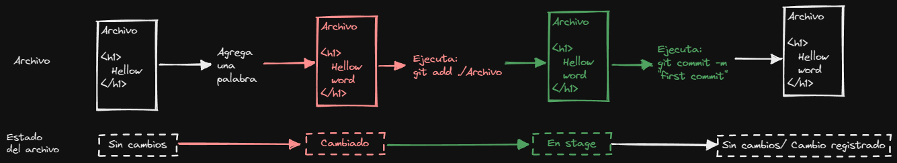
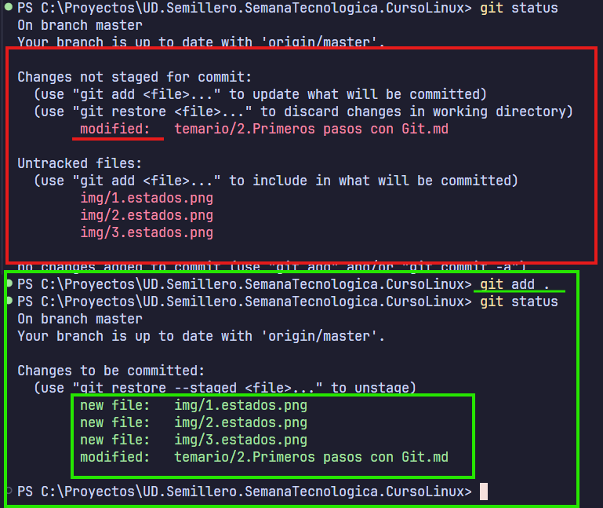
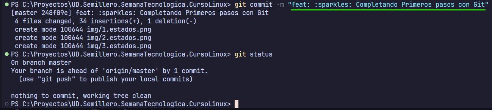

# Primeros pasos con Git (60 minutos)
**Objetivo:** Familiarizar a los participantes con los comandos básicos.

## Temas:
- `git status`, `git add`, y `git commit`: Cómo registrar cambios en el repositorio.
  - `git status`: Muestra el estado del repositorio.
    - Estado de los archivos en el directorio actual.
      - Si esta en el stage el archivo se vera verde.
      - No esta en el stage el archivo se vera rojo.
    - Stage: Se refiere al estado es como si estubiese en el limbo antes de registrar el cambio.

[imagen de ejemplo](../img/1.estados.png)

- Concepto de commits y cómo escribir buenos mensajes de commit.
  - Convención de commits: Los mensajes de commit deben ser significativos.
  - [Pagina de convenciones](https://www.conventionalcommits.org/en/v1.0.0/)
- Ejemplo de nomenclatura de commits.

| Description                          | Type     | Format | Example                                    |
|--------------------------------------|----------|--------|--------------------------------------------|
| **Requirements and Features**        | feat     | `:sparkles:`    | feat: :sparkles: Include new feature       |
| **Change Control**                   | feat     | `:boom:`        | feat: :boom: Service implementation        |
| **Defects and Incidents**            | fix      | `:construction:`| fix: :construction: Mapping is corrected   |
| **Fix bugs**                         | fix      | `:bug:`         | fix: :bug: Mapping order fix               |
| **Immediate correction is required** | fix      | `:ambulance:`   | fix: :ambulance: Fix flow bug              |
| **Phase or sprint implemented**      | feat     | `:package:`     | feat: :package: Feature is included        |
| **Add, update or pass tests**        | test     | `:white_check_mark:` | test: :white_check_mark: New tests added |
| **Add or update documentation**      | docs     | `:memo:`        | docs: :memo: Update doc                    |
| **Add or update UI styles**          | style    | `:lipstick:`    | style: :lipstick: Update UI                |
| **Write bad code needed review**     | refactor | `:poop:`        | refactor: :poop: Fix this please |
| **Remove files**                     | feat     | `:fire:`        | feat: :fire: Remove file                   |
| **Reverting changes**                | revert   | `:rewind:`      | revert: :rewind: I shouldn't do that again |
| **Improving Performance**            | perf     | `:zap:`         | perf: :zap: Optimizing code                |

## Actividad Práctica (30 minutos):
- Crear archivos, modificarlos y hacer commits.
- Jugar con `git status` y entender el flujo de trabajo de staging.

- Crear mensajes de commit significativos.

