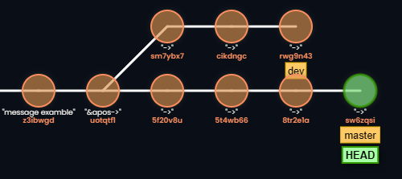
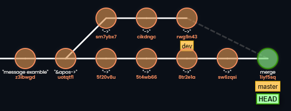

# Ramas y colaboración (55 minutos)
**Objetivo:** Entender el concepto de ramas y cómo colaborar con otros.

## Temas: (15 minutos)
- Concepto de ramas (`git branch`, `git checkout`).
    - Que es una rama? : Una rama es una referencia a un punto en el historial del repositorio. Es una bifurcación en la rama actual.
    

- Crear nuevas ramas para trabajar en nuevas funcionalidades.
  - Por qué crear nuevas ramas?
    - Porque puedes trabajar en diferentes funcionalidades sin interferir con otras personas.
    - Por que puedes hacer cambios sin afectar a ramas que estan en producción.

- Combinar ramas (`git merge`), conflictos y cómo resolverlos.

    

    - Que es un conflicto de merge?
      - Un conflicto de merge es cuando dos ramas tengan cambios en el mismo archivo y Git no puede saber cual cambio quiere aplicar.
      - Por ejemplo, si tenemos una rama llamada `develop` y otra llamada `main` y ambas tienen cambios en el mismo archivo `README.md` pero en diferentes ramas.
      - Git no sabe cual cambio quiere aplicar.
      - Para resolver este conflicto se debe o establecer una prioridad para cada rama o resolver el conflicto de manera manual.
## Explicación con plataforma (10 minutos):
- ingreso a GitCol-Learning de en modo un solo usuario.
- [Link GitCol-Learning](gitcol-learning.onrender.com)
- Inicie un repositorio en la plataforma remota.
  - `git init`
- Agrege un commit al repositorio.
  - `git commit -m "mensaje del commit"`
- Crea una nueva rama.
  - `git branch <nombre-de-la-rama>`
- Cambia de rama.
  - `git checkout <nombre-de-la-rama>`
- Agrege un commit a la rama recien creada.
  - `git commit -m "mensaje del commit"`
- Regrese a la rama`master`.
  - `git checkout main`
  - `git checkout master`
- Haga un `merge` de la rama recien creada con la rama `main` o `master`.
  - `git merge <nombre-de-la-rama>`
  - `git merge master`
## Actividad Práctica (30 minutos):
- Crear una nueva rama, hacer algunos cambios y hacer merge con `master`.
```bash
git branch <nombre-de-la-rama>
```
```bash
git branch prueba
git checkout prueba
```
o tambien usar para ir al **start-point** de la rama recien creada:
> [!NOTE]
> Un **start-point** es un commit en el que se inicia la rama. Pero la forma en la que uno se refiere a dicho **commit** puede ser su id o el nombre de la rama o una etiqueta o una notación como `HEAD~1`.
```bash
git checkout -b <nombre-de-la-rama> <start-point>
```
```bash
git checkout -b prueba HEAD~1
```
El **start-point** de la rama "prueba" es el commit `HEAD~1` que hace referencia al commit anterior a HEAD.