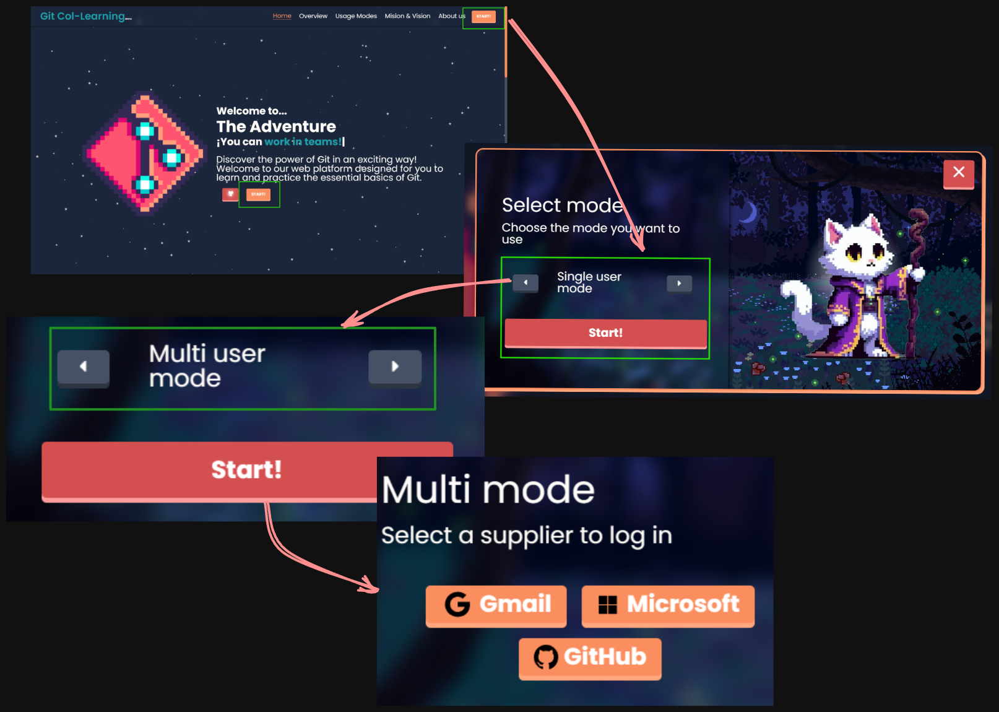
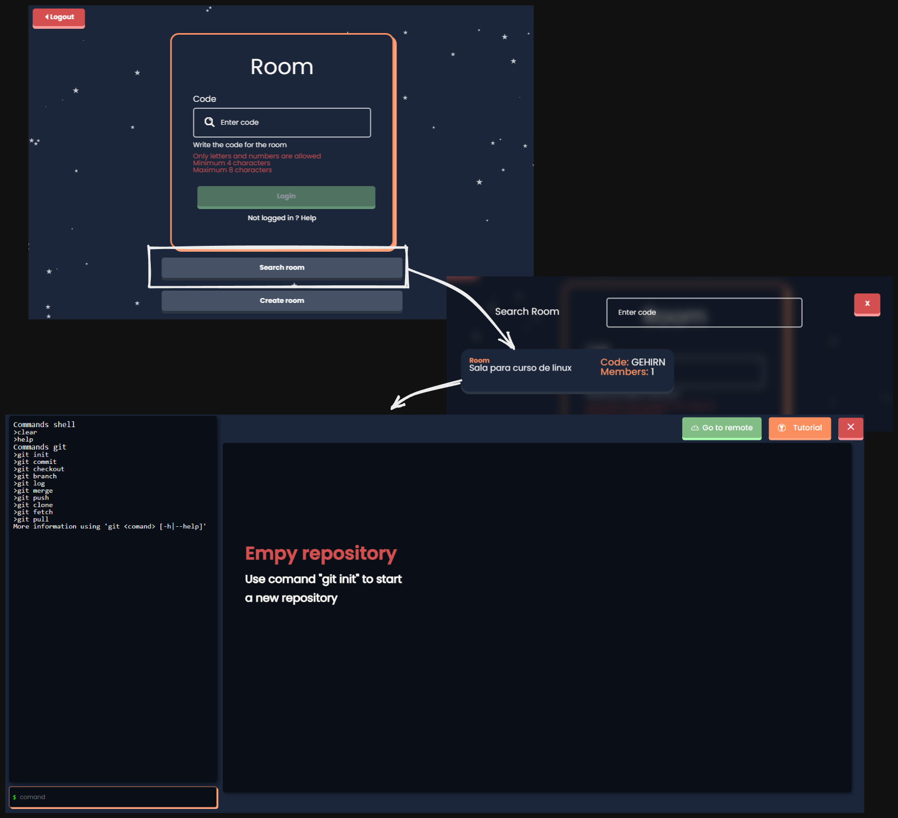
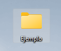
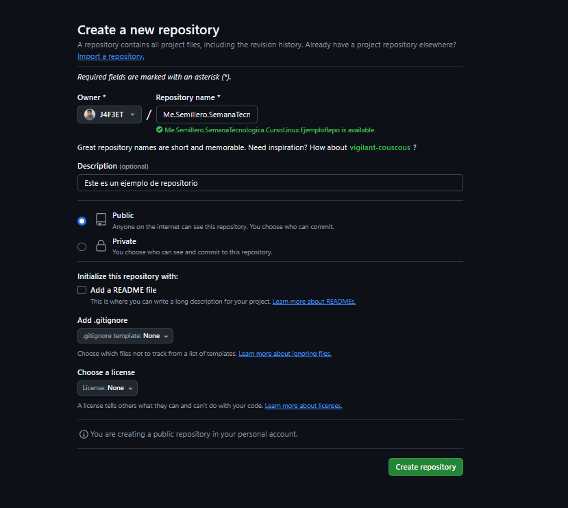
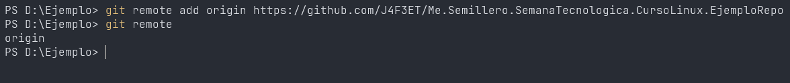
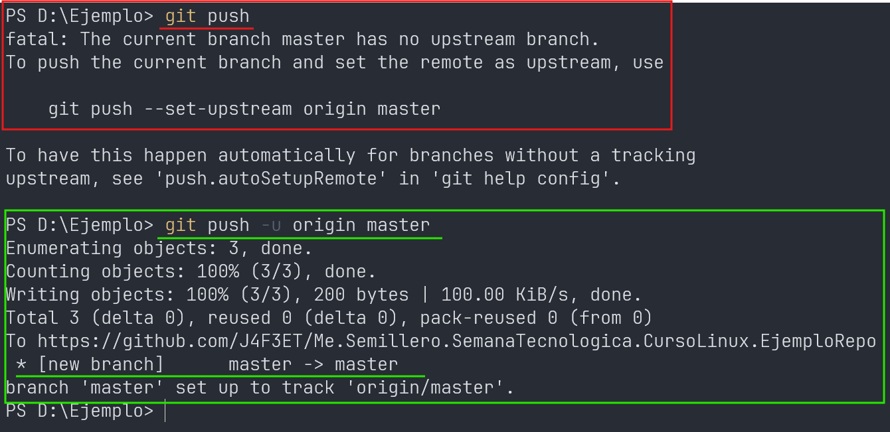

# Gestión de Repositorios Remotos (35 minutos)
**Objetivo:** Explicar cómo conectar un repositorio local a un remoto.

## Temas:
- ¿Qué es un repositorio remoto? Diferencias entre GitHub, GitLab, y Bitbucket.
  - Un repositorio remoto es un repositorio alojado en una plataforma de alojamiento de repositorios Git como GitHub, GitLab, o Bitbucket.
- Uso de `git remote`, `git clone`, y `git push`.
  - `git remote`: Muestra las conexiones remotas.
    - Por defecto, Git al clonar un repositorio clona el repositorio y crea una conexión remota llamada `origin`.
  - `git clone`: Clona un repositorio
    - Por defecto, clona el repositorio en el directorio actual.
  - `git push`: Envia los cambios del repositorio al repositorio remoto.
    - Por defecto, envia los cambios al repositorio remoto llamado `origin`.
- `git pull`, `git fetch` y `git merge`.
  - `git pull`: Descarga los cambios del repositorio remoto y los aplica a el repositorio local.
    - Por defecto, descarga los cambios del repositorio remoto llamado `origin`.
  - `git fetch`: Descarga los cambios del repositorio remoto sin aplicarlos al repositorio local.
    - Por defecto, descarga los cambios del repositorio remoto llamado `origin`. Creando referencias a los cambios del repositorio remoto (origin/nombre-de-la-rama).
  - `git merge`: Combina los cambios del repositorio remoto con el repositorio local.


## Explicación con plataforma (10 minutos):
* ingreso a GitCol-Learning de manera remota
* [Link GitCol-Learning](gitcol-learning.onrender.com)



## Actividad Práctica (30 minutos):
- Crear un repositorio local.



- Crear un repositorio remoto.



- Conectar el repositorio local a GitHub.
>[!NOTE]
> Extraer la URL del repositorio remoto.

**Comandos:**
```bash
git remote add <nombre de la conexión> <url de la conexión>
```
```bash
git remote add origin https://github.com/J4F3ET/UD.Semillero.SemanaTecnologica.CursoLinux.EjemploRepo
```


- Listar los cambios del repositorio remoto.

- Hacer `push` de los cambios al repositorio remoto.


!
- Clonar un repositorio existente y explorar su contenido.

```bash
git clone <url de la conexión>
```
```bash
git clone https://github.com/J4F3ET/UD.Semillero.SemanaTecnologica.CursoLinux.EjemploRepo
```


