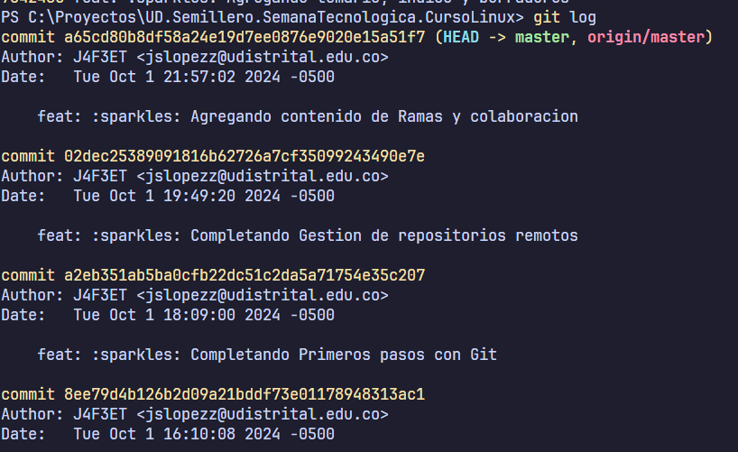
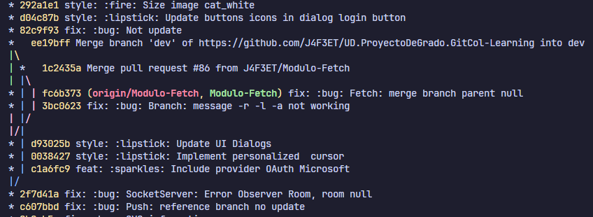

# Exploración y Historia de los Cambios (30 minutos)
**Objetivo:** Enseñar a navegar por el historial de commits.

## Temas:
- Uso de `git log` y opciones como `--oneline`.
  - Muestra el historial de commits pero se tienen varias opciones que se pueden usar para mostrar el historial de commits de manera más clara.
  - `--oneline`: Muestra el historial de commits en una sola línea.
  - `--graph`: Muestra el historial de commits en forma de gráfico.
  - `--decorate`: Muestra el historial de commits con detalles adicionales.
## Actividad Práctica (15 minutos):
- Visualizar la historia de los commits en el proyecto y moverse a través de ellos.
```bash
git log
```


- Visualizar la historia de los commits en el proyecto y moverse a través de ellos.
```bash
git log --oneline
```
- Visualizar la historia de los commits en el proyecto y moverse a través de ellos.
```bash
git log --graph --oneline -n 30
```
